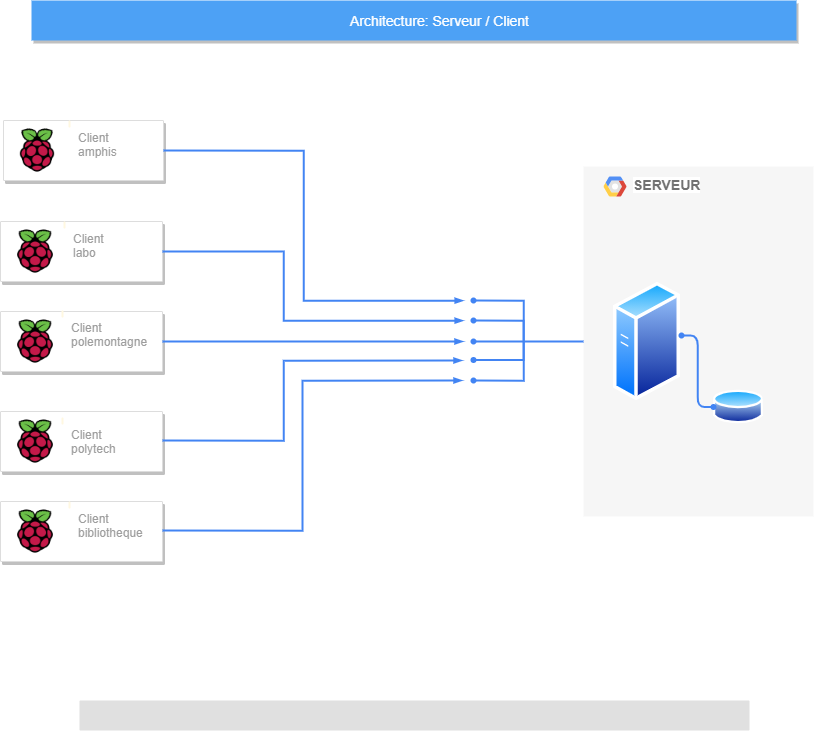
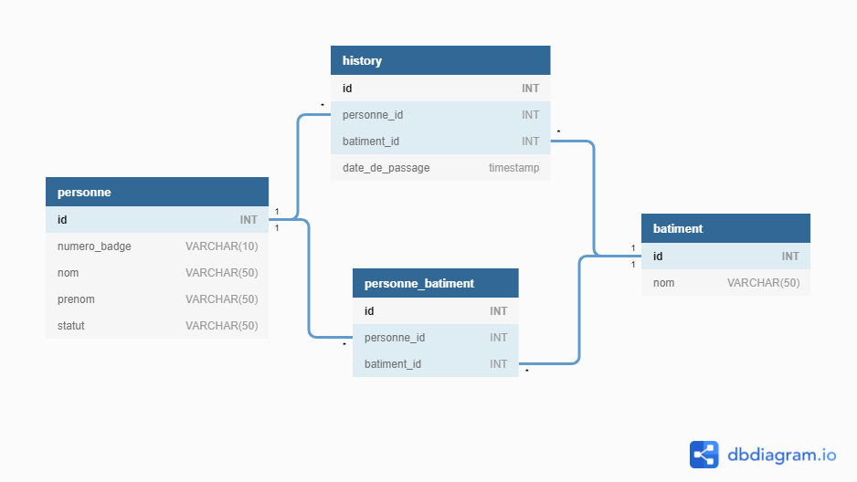

# INFO 801
## Contributeurs
Sylejmani Visar et Mahri Hamza

---
### Architecture
| Description | Architecture |
| ---- | ----------- |
| L'architecture principale est donc: | Client/Serveur |
| On y trouve aussi l'architecture : |MVC |

---
#### Voici une illustration

### Chaque client est traité sous un thread, quant à la communication Client/Serveur , on utilise **socket** , une **librairie** python.  La communication se fait donc avec un HEADER ayant besoin de savoir combien d'octets on va recevoir , on envoit donc d'abords le nombre d'octets
### Envoit : 

`msg = "status,lumiereRouge"` # Le message à envoyer  
`message = msg.encode(FORMAT)` # On doit toujours encoder notre message et avoir un format general 
`msg_length = len(message)` # La longeur du message 
`send_length = str(msg_length).encode(FORMAT)` # On le cast en string 
`send_length += b' ' * (HEADER - len(send_length))` # Vu qu'on doit avoir un nombre d'octets fixe 
`conn.send(send_length)` # On envoit le nombre d'octets qu'on va envoyer au msg suivant 
`conn.send(message)` # On envoit le message  

---
### Reception : 
`msg_length = conn.recv(HEADER).decode(FORMAT)` # Reception de la longeur du message suivant 
`msg_length = int(msg_length)` # On le cast en int 
`msg = conn.recv(msg_length).decode(FORMAT)` # On stock le message reçu sur la variable *msg*

---
## Installation :
### Si vous n'avez pas docker je vous invite a l'[installer](https://docs.docker.com/get-docker/) les nouvelles version de docker incluent compose vous remplacerez *docker-compose* par *docker compose*.

---
## Demarrer les containers :
`docker-compose up -d`
## Tests :
### Vous devez lancer des terminaux :
`docker exec 'nom du container ou son id' -itd sh` 
Lancez d'abord le terminal du serveur et lancez le avec la commande `python server.py`
puis sur un des containers `python client.py`

---
## Visualiser la base de données
### Le docker publie *adminer* sur le port *8080* pour le visualiser [http://localhost:8080/](http://localhost:8080/)
### Les variables :
| Nom | Variable |
|---|---|
| Système | MySQL|
| Serveur | mariadb |
| Utilisateur | user |
| Mot de passe | password |
| Base de données | info801 |

## Les tables

